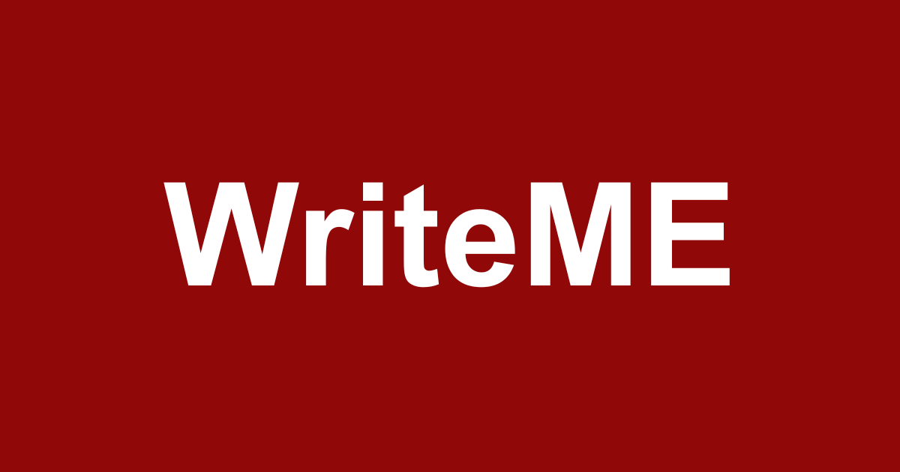

# :pencil2: WriteME | A ReadME Markdown Editor :book:

WriteME acts as an online readME markdown text editor.
Designed for GitHub ReadME design.

[Try it now! Available online](https://writeme.pages.dev/editor)

Quick Links
1. [File Panel](#file-panel)
2. [Edit Panel](#edit-panel)
3. [Emoji Panel](#emoji-panel)

My Links
1. [Portfolio](https://noah-macdonald.com)
2. [GitHub](https://github.com/NoahAdamMacDonald)
3. [LinkedIn](https://www.linkedin.com/in/noah-macdonald-kingston24052002/)
4. [Email](mailto:contact@noah-macdonald.com)


| Features | Supports |
| :--- | :--- |
| Light Mode & Dark Mode | :white_check_mark: |
| Importing / Exporting Files | :white_check_mark: |
| Copy to Clipboard | :white_check_mark: |
| Resizable Sidebar Menu | :white_check_mark: |
| Tab / Shift+Tab | :white_check_mark: |
| Syntax Highlighting For 193 Languages | :white_check_mark: |
| AI Auto Formatting | :white_check_mark: |
| In Editor Highlighting | :white_check_mark: |


- - - -


# File Panel

The file panel is used for

1. importing .md and .txt files to the writeME editor
2. Exporting to file with 'README.md' as the default
3. Copying the content of the editor to clipboard
4. Auto Formatting content using AI
    1. Options to format
    2. Regenerate format
    3. Revert format

> [!NOTE]
> Regenerate may give same results in certain cases

[To Top](#top)


- - - -


# Edit Panel

Edit Panel is the main form of interacting with the editor, supporting multiple options in easy
to use drop down menus.

## Headings
Inserts a heading at the start of the currently selected line.
Supports from H1 - H6.

Example:
`Test line` 
to
`### Test line`

> [!TIP]
> Reselecting the same heading of the currently applied will remove the heading

All Headings
`# H1`
`## H2`
`### H3`
`#### H4`
`##### H5`
`###### H6`


- - - -


## Typography
Wraps the highlighted text or current line in styling typography.
Supports **Bold**, _Italic_, ~~Strikethough~~

Example:
`**Bold**, _Italic_, ~~Strikethough~~`

> [!TIP]
> Reselecting the styling will remove it if already applied

Supports applying **_~~multiple stylings~~_** at once

Example:
`**_~~multiple stylings~~_**`


- - - -


## Alerts
Click to apply 1 of 6 different alert or quote options to the current
line of text or highlighted text to apply mulitple lines at once.

Supports

> [!NOTE]
> Note

> [!TIP]
> Tip

> [!WARNING]
> Warning

> [!IMPORTANT]
> Important

> [!CAUTION]
> Caution

> Quotes

```plaintext
> [!NOTE]
> Note

> [!TIP]
> Tip

> [!WARNING]
> Warning

> [!IMPORTANT]
> Important

> [!CAUTION]
> Caution

> Quotes
```

> [!TIP]
> Reapplying the same alert will remove it
> Applying a different alert to an existing one will replace the current one

> [!CAUTION]
> Ensure to have at least one line between different alerts
> If no line space between them GitHub markdown will place 
> the second alert within the first


## Lists
Apply list item to highlighted content or current line. 
Works with indented lists

Supports

- Bullet
    - Bullet
        - Bullet
        - Bullet
- Bullet
    - Bullet

1. Numbered
    1. Numbered
        1. Numbered
        2. Numbered
2. Numbered
    1. Numbered

- [ ] Task
    - [x] Task
        - [ ] Task
        - [ ] Task
- [x] Task
    - [x] Task

> [!NOTE]
> To check Task reapply task while currently selecting it.
> Reapply again to remove list

```plaintext
- Bullet
    - Bullet
        - Bullet
        - Bullet
- Bullet
    - Bullet

1. Numbered
    1. Numbered
        1. Numbered
        2. Numbered
2. Numbered
    1. Numbered

- [ ] Task
    - [x] Task
        - [ ] Task
        - [ ] Task
- [x] Task
    - [x] Task
```


- - - -


## Code
Used to add Code blocks with language styling or inline blocks of code / plaintext

### inline
used for single line text, lacks syntax highlighting

Example: `Console.WriteLine("Hello World");` inline


code block with syntax
```csharp
Console.WriteLine("Hello World");
```

### Code Block
Supports 193 different languages with syntax highlighting
while working in editor through the use of highlight.js

Code Block editor supports self closing brackets and quotes, <kbd>⇥</kbd> Indentation and <kbd>Shift + ⇥</kbd>.

Language Search for easily finding language to highlight.

Supports Many different languages

cpp
```cpp
#include <iostream>
int main() { std::cout << "Hi"; }
```

Typescript
```typescript
interface User { id: number; name: string }
const u: User = { id: 1, name: "Noah" };
```

Brainfuck
```brainfuck
+++++ +++++ [> +++++ ++<-] >++.
```

Java
```java
class Main {
    public static void main(String[] args) { 
        System.out.println("Hi"); 
    } 
}
```

SQL
```sql
SELECT * FROM users WHERE active = true;
```

COBOL
```cobol
       IDENTIFICATION DIVISION.
       PROGRAM-ID. HELLO.
       PROCEDURE DIVISION.
           DISPLAY "Hello, world".
           STOP RUN.
```

Haskell
```haskell
square x = x * x
main = print (square 5)
```

And Much More


> [!WARNING]
> WriteME uses highlight.js for its languages, due to this there are cases where
> highlight may support a language that GitHub does not have highlighting for or
> where the names are different, highlight.js does not have a dedicated html tag, in this case XML
> is the compatible one between the two. I am looking into a possible fix for the future.


- - - -


## Links
Used to add links to URLs, ReadME sections, embed an image or embed a link to a youtube video with the video
preview as the link.

### URL Links
Provide a url and link text to insert a link

> [!TIP]
> If no http or https is provided, it defaults to adding https.
> If no TLD is provided, defaults to .com

[example](https://noah-macdonald.com)

`[example](https://noah-macdonald.com) `


### Section Links
Provide a link text and select one of the available sections.
Sections are added from headings added to the ReadME.
TOP is the only existing section by default.

[example: go to section link](#section-links)

`[example: go to section link](#section-links)`


### Embed Image
Add the URL to an image to have it embedded in the readME
Can use either relative or absolute url to image

Relative


``

Absolute


``


### Embed Youtube
Add the Youtube URL or Youtube Video Id to insert a link to the youtube video that uses the image
preview image as its link.

> [!NOTE]
> Because GitHub README does not support proper video embedding this is closest method to mimic it.

[](https://www.youtube.com/watch?v=dQw4w9WgXcQ)

`[](https://www.youtube.com/watch?v=dQw4w9WgXcQ)`


- - - -


## Misc
Items that did not belong in their own category

### Divider
insert a one line divider to break up different sections, select again to remove

`- - - -`


### Foldable Text
Adds folding drop down text, supports multiple lines or just a single.

<details>
  <summary>Summary Line</summary>
   <p>This is a line</p>
 <p>Hello</p>
 <p>World</p>
</details>

```plaintext
<details>
      <summary>Summary Line</summary>
       <p>This is a line</p>
 <p>Hello</p>
 <p>World</p>
    </details>
```


### Table
Adds a table item, defaults as 2x2 with ability to add or remove columns and rows.
Can easily swap column/row by selecting its swap button and then selecting another column/row swap button
Defaults to Left aligned, click on the alignment button to toggle alignment

| Left aligned Column | Center Aligned | Right Aligned |
| :--- | :---: | ---: |
| Text is left aligned | Text is |  |
|  | Center |
|  | Aligned | Text is right aligned |

```plaintext
| Left aligned Column | Center Aligned | Right Aligned |
| :--- | :---: | ---: |
| Text is left aligned | Text is |  |
|  | Center |
|  | Aligned | Text is right aligned |
```


### Hotkey
Used to insert hotkey buttons to text

MacOS

| Hotkey | Symbol |
| :--- | ---: |
| Command | <kbd>⌘</kbd> |
| Shift | <kbd>⇧</kbd> |
| Option | <kbd>⌥</kbd> |
| Control | <kbd>⌃</kbd> |
| Caps Lock | <kbd>⇪</kbd> |

Windows

| Hotkey | Symbol |
| :--- | ---: |
| Ctrl | <kbd>Ctrl</kbd> |
| Alt | <kbd>Alt</kbd> |
| Shift | <kbd>Shift</kbd> |
| Windows | <kbd>⊞</kbd> |

Navigation

| Hotkey | Symbol |
| :--- | ---: |
| Up | <kbd>↑</kbd> |
| Down | <kbd>↓</kbd> |
| Left | <kbd>←</kbd> |
| Right | <kbd>→</kbd> |
| Page Up | <kbd>⇞</kbd> |
| Page Down | <kbd>⇟</kbd> |
| Home | <kbd>↖</kbd> |
| End | <kbd>↘</kbd> |

Special

| Hotkey | Symbol |
| :--- | ---: |
| Tab | <kbd>⇥</kbd> |
| Backtab | <kbd>⇤</kbd> |
| Return | <kbd>↩</kbd> |
| Enter | <kbd>⏎</kbd> |
| Delete | <kbd>⌫</kbd> |
| Forward Delete | <kbd>⌦</kbd> |
| Escape | <kbd>⎋</kbd> |
| Power | <kbd>⌽</kbd> |

Function

| Hotkey | Symbol |
| :--- | :--- |
| F1 | <kbd>F1</kbd> |
| F2 | <kbd>F2</kbd> |
| F3 | <kbd>F3</kbd> |
| F4 | <kbd>F4</kbd> |
| F5 | <kbd>F5</kbd> |
| F6 | <kbd>F6</kbd> |
| F7 | <kbd>F7</kbd> |
| F8 | <kbd>F8</kbd> |
| F9 | <kbd>F9</kbd> |
| F10 | <kbd>F10</kbd> |
| F11 | <kbd>F11</kbd> |
| F12 | <kbd>F12</kbd> |


- - - -

[To Top](#top)

# Emoji Panel
Used for easy access to emojis. Has search function for easily finding emojis.

> [!NOTE]
> Region flags were excluded due to them being unique in handling compared to other emoji types.

:grinning::monkey_face::grapes::earth_africa::jack_o_lantern::eyeglasses::atm::checkered_flag:

On Export / Copy To Clipboard all emojis are converted to their emoji code text.

On Import all emoji code are converted to emojis for easy use in editor.

example: 

:grinning: exported to `:grinning:`

`:grinning:` imported to :grinning:


- - - -


README created using WriteME
Visit now at [writeme.pages.dev](https://writeme.pages.dev/editor)

